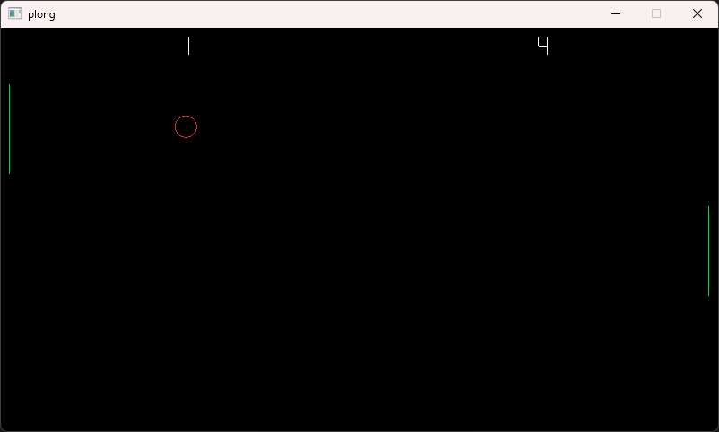

# Plong

Pong style game written in [zig](https://github.com/ziglang/zig) with [Raylib](https://github.com/raysan5/raylib).

Bindings by [raylib-zig](https://github.com/Not-Nik/raylib-zig)

This was made as a way to learn/explore zig and raylib simultaneously.

Run with `zig build run`

Build with `zig build`

